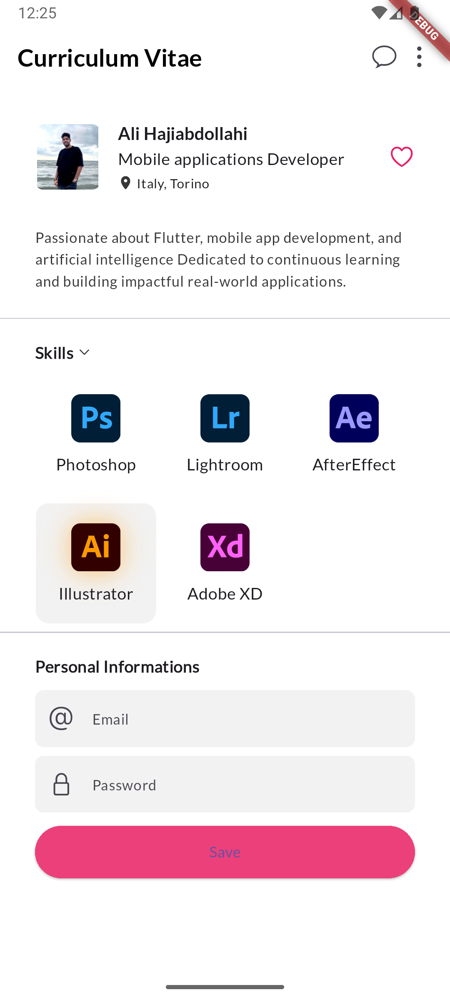
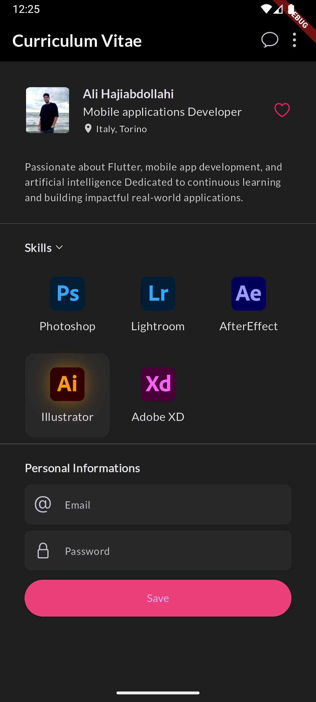

# Flutter Profile CV App 📱

My first Flutter project - a personal CV/resume mobile application showcasing profile information with modern UI design.

## 🎯 Project Overview

This is my inaugural Flutter development project, created to learn mobile app development while building a practical personal CV application. The app displays information in an elegant, mobile-friendly interface with both light and dark theme support.

## ✨ Features

- **Professional Profile Display** - Clean layout showing personal information
- **Dual Theme Support** - Light and dark themes with smooth transitions
- **Custom Typography** - Google Fonts integration (Lato) for enhanced readability
- **Responsive Design** - Optimized for various mobile screen sizes
- **Modern UI Components** - Material Design principles with custom styling
- **Asset Management** - Proper image asset integration

## 🛠 Technologies Used

- **Flutter** - UI framework for cross-platform mobile development
- **Dart** - Programming language
- **Google Fonts** - Custom typography
- **Material Design** - UI design system
- **Asset Management** - Image and resource handling

## 📥 Download & Install

### 📱 Ready to use APK
Download the latest release and install directly on your Android device:

[](https://github.com/Ali-HajiAbdollahi/flutter_profile_app/releases/download/v1.0.0/FlutterProfileCV-v1.0.0.apk)

**Latest Version**: v1.0.0  
**File Size**: ~20MB  
**Compatibility**: Android 5.0+ (API level 21+)

### 📋 Installation Steps
1. Download the APK from the link above
2. Enable "Install from Unknown Sources" in your Android settings
3. Open the downloaded APK file
4. Follow the installation prompts
5. Enjoy the Flutter Profile CV app!

## 📱 App Screenshots

### Light Theme
<p align="left">
  
</p>

### Dark Theme
<p align="left">
  
</p>

## 🚀 Getting Started (For Developers)

### Prerequisites
- Flutter SDK (3.29.0 or higher)
- Dart SDK
- Android Studio / VS Code with Flutter extension
- Android/iOS emulator or physical device

### Installation

1. **Clone the repository**
   ```bash
   git clone https://github.com/Ali-HajiAbdollahi/flutter_profile_app.git
   cd flutter_profile_app
   ```

2. **Install dependencies**
   ```bash
   flutter pub get
   ```

3. **Run the app**
   ```bash
   flutter run
   ```

## 🎨 Design Highlights

- **Dark Theme**: Professional dark color scheme with proper contrast
- **Light Theme**: Clean, bright interface for optimal readability
- **Typography**: Lato font family for modern, professional appearance
- **Layout**: Organized profile information with proper spacing and alignment

## 📚 Learning Outcomes

Through this project, I gained experience in:

- Flutter widget system and layout management
- State management and theme switching
- Asset integration and resource management
- Material Design implementation
- Git version control for Flutter projects
- Mobile app development best practices

## 🔧 Key Components

- **ThemeData Configuration** - Custom light/dark themes
- **Google Fonts Integration** - Professional typography
- **Asset Management** - Image and icon handling
- **Responsive Layouts** - Adaptive UI components
- **Material Widgets** - AppBar, Cards, Buttons, etc.


## 👨‍💻 About the Developer

This project represents my first step into Flutter development, combining learning objectives with practical application. Built as a foundation for understanding mobile app development principles and Flutter framework capabilities.

---

**Project Status**: ✅ Completed  
**Development Period**: November 2025  
**Platform**: Cross-platform (Android/iOS)  
**Framework**: Flutter
